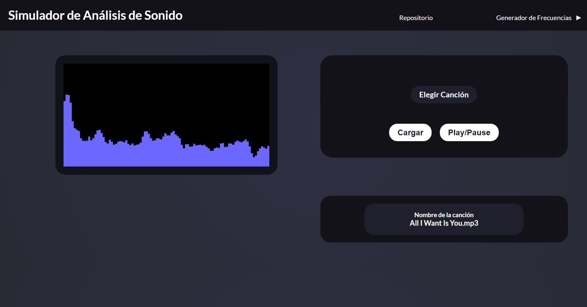
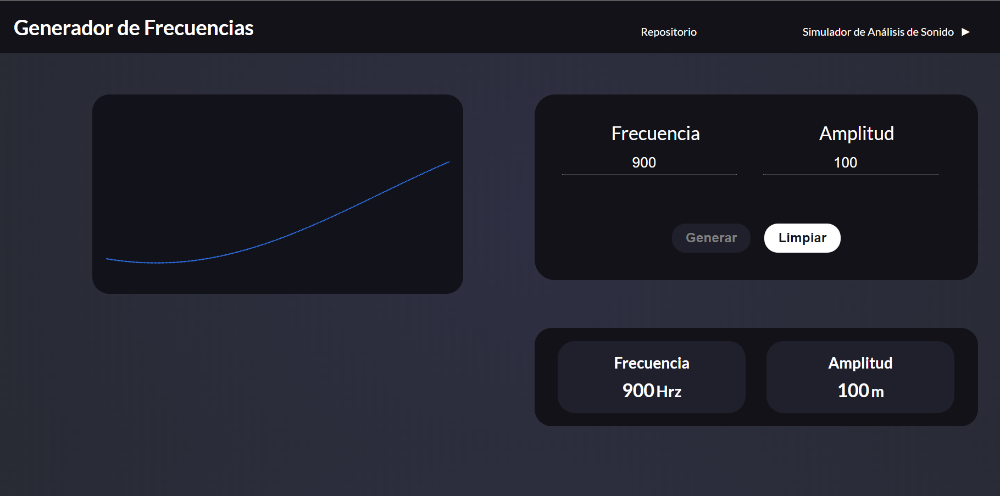

# Simulador de Análisis de Sonido

Simulador para visualizar los elementos del sonido mediante frecuencia y amplitud.

**Preview**

**URL:** https://ts-sound-visualization.web.app/

**Imagenes:**

****

## Como usarlo?
### 1. Simulador de Análisis de Sonido.
1. Escoja una canción de su sistema de archivos mediante el botón Elegir canción
2. Haga click en el botón de cargar. Espere unos momentos a que la canción se cargue en el navegador.
3. Haga click en el botón de Play/Pause
4. Visualice la gráfica de frecuencias de la canción.
### 2. Generador de Frecuencias.
1. Ingrese los valores de frecuencia y amplitud en los inputs.
2. Haga click en el botón Generar, este generará la gráfica y el sonido a escuchar. Este botón permanece inactivo hasta que se limpie el buffer de sonido.
3. Para limpiar el simulador haga click en el botón Limpiar. Este se encarga de limpiar la gráfica y el buffer de sonido.